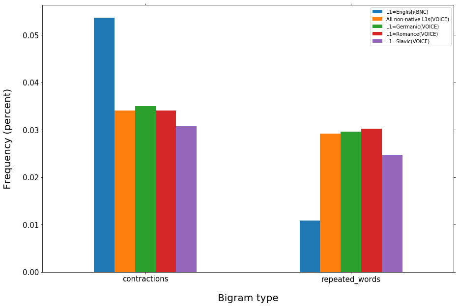

Katherine Kairis, kak275@pitt.edu, 12/15/2017

# Bigram Analysis
## Table of Contents
* Creating sub-corpora for different language families(#creating-sub-corpora-for-different-language-families)
* Comparing Bigrams of Native and Non-native Speakers: Round 1(#comparing-bigrams-of-native-and-non-native-speakers:-round-1)
* Comparing Contraction Use(#comparing-contraction-use)
* Comparing Bigrams of Native and Non-native Speakers: Round 2(#comparing-bigrams-of-native-and-non-native-speakers:-round-2)


```python
import pickle
import nltk
from nltk.corpus import stopwords
import pandas as pd
import matplotlib.pyplot as plt
stopWords = set(stopwords.words('english'))

from IPython.core.interactiveshell import InteractiveShell
InteractiveShell.ast_node_interactivity = "all"
```

## Helper Functions
* speech_by_L1: takes a conversation dictionary and a list of languages. Eliminates the utterances of any participants whose L1 is not included in the list of languages.
* get_bigrams: takes a conversation dictionary and returns a list of bigrams
* repeated_words: takes a list of bigrams and returns a new list consisting of bigrams that contain duplicated words 
* frequent_bigrams: takes a list of bigrams and a number, n, between 0 and 1 (representing a percentage), and returns a list of bigrams that fall in the top n% in terms of frequency
* shared_bigrams: takes two lists of bigrams, A and B, and returns all of B's bigrams that also occur in A


```python
"""
Takes a conversation dictionary and a list of languages. Returns a dictionary of conversations containing only 
utterances from participants whose L1 is listed in the list of languages.
"""
def speech_by_L1(conversation_dict, lang_list):
    new_dict = {}
    for conversation in conversation_dict.keys():
        utterances = {}
        
        for pair in conversation_dict[conversation]:    
            speaker = pair[1]
            #print(conversation_dict[conversation][pair])

            
            #print(participants[speaker]['L1'][0])
            if(participants[speaker]['L1'][0] in lang_list):
                utterances[pair] = conversation_dict[conversation][pair]
            

        new_dict[conversation] = utterances    

    return new_dict
```


    '\nTakes a conversation dictionary and a list of languages. Returns a dictionary of conversations containing only \nutterances from participants whose L1 is listed in the list of languages.\n'


```python
"""
Takes a dictionary of conversations from a corpus, and returns a list of bigrams.
"""
def get_bigrams(dictionary):
    bigrams = []
    for file in dictionary:
        for key in dictionary[file]:
            pairs = list(nltk.bigrams(dictionary[file][key]))
            bigrams.extend(pairs)
    return bigrams
```


    '\nTakes a dictionary of conversations from a corpus, and returns a list of bigrams.\n'


```python
"""
Takes a list of bigrams, returns dictionary whose keys are bigrams containing duplicate words (e.g ('i', 'i',), 
'the', 'the') and whose values are the frequencies of each bigram
"""
def repeated_words(bigrams):
    repeated = {}
    for b in bigrams:
        if(b[0] == b[1]):
            if(b not in repeated):
                repeated[b] = 1
            else:
                repeated[b] += 1
    return repeated
```


    "\nTakes a list of bigrams, returns dictionary whose keys are bigrams containing duplicate words (e.g ('i', 'i',), \n'the', 'the') and whose values are the frequencies of each bigram\n"


```python
"""
Takes a list of bigrams and a percentage between 0 and 1. Returns a dictionary whose keys are bigrams and whose values
are the frequencies of the bigrams. The bigrams included in the dictionary are only the ones that occur in the top 
given percent. For example, if the user inputs BNC_bigrams 0.3, the returned dictionary will occur the top 30% of 
bigrams in terms of their frequencies. The BNC has 9378696 bigram occurrences, so the dictionary will contain around 
1875739 entries.
"""

def frequent_bigrams(bigrams, percent):
    freqs = nltk.FreqDist(bigrams)
    most_common = freqs.most_common()
    limit = len(bigrams) * percent
    num_occurrences = 0
    top_bigrams = []
    
    for b in freqs.most_common():
        num_occurrences += b[1]
        if(num_occurrences >= limit):
            return top_bigrams
        top_bigrams.append(b)
    return count_dictionary
```


    '\nTakes a list of bigrams and a percentage between 0 and 1. Returns a dictionary whose keys are bigrams and whose values\nare the frequencies of the bigrams. The bigrams included in the dictionary are only the ones that occur in the top \ngiven percent. For example, if the user inputs BNC_bigrams 0.3, the returned dictionary will occur the top 30% of \nbigrams in terms of their frequencies. The BNC has 9378696 bigram occurrences, so the dictionary will contain around \n1875739 entries.\n'


```python
"""
Takes two lists, a and b, that contain bigrams and their frequencies. e.g. [(('it', "'s"), 68661),
 (('that', "'s"), 45150),
 (('do', "n't"), 42215),] 
Returns a list of bigrams in b that are also in a.
"""
def shared_bigrams(list_a, list_b):
    common = []
    list_a = [b[0] for b in list_a]
    list_b = [b[0] for b in list_b]
    
    count = 0
    for bigram in list_b:
        if(bigram in list_a):
            common.append(bigram)
    return common
```


    '\nTakes two lists, a and b, that contain bigrams and their frequencies. e.g. [((\'it\', "\'s"), 68661),\n ((\'that\', "\'s"), 45150),\n ((\'do\', "n\'t"), 42215),] \nReturns a list of bigrams in b that are also in a.\n'


## Creating sub-corpora for different language families
Create 3 different subcorpora from the VOICE corpus. The three new corpora will be:
* germanic: contains the utterances of participants with Germanic L1s(German, Dutch, Swedish, Danish, Norwegian, and Icelandic)
* romance: contains the utterances of participants with Romance L1s (Portuguese, Spanish, Italian, French, Catalan, Romanian)
* slavic: contains the utterances of participants with Slavic L1s (Russian, Ukranian, Polish, Bulgarian, Macedonian, Czech, Bosnian, Slovak, Slovenian)


```python
#Get the tokens for each corpus from their respective pickle files
#Also get the dictionary containing the participant info for VOICE
f = open('VOICE_tokenized.p', 'rb')
VOICE_toks = pickle.load(f)
f.close()

f = open('BNC_tokenized.p', 'rb')
BNC_toks = pickle.load(f)
f.close()

f = open('VOICE_participant_info.p', 'rb')
participants = pickle.load(f)
f.close()
```


```python
"""
Create sub-corpora from the VOICE corpus, each of which will contain utterances from L1 speakers of German languages,
Romance languages, and Slavic languages
"""
lang_classifications = {'germanic': ['ger', 'dut', 'swe', 'dan', 'nor', 'ice'],
                        'romance': ['por', 'spa', 'ita', 'fre', 'cat', 'rum'],
                        'slavic': ['rus', 'ukr', 'pol', 'bul', 'mac', 'cze', 'bos', 'slo', 'slv']}

germanic_toks = speech_by_L1(VOICE_toks, lang_classifications['germanic'])
romance_toks = speech_by_L1(VOICE_toks, lang_classifications['romance'])
slavic_toks = speech_by_L1(VOICE_toks, lang_classifications['slavic'])
```


    '\nCreate sub-corpora from the VOICE corpus, each of which will contain utterances from L1 speakers of German languages,\nRomance languages, and Slavic languages\n'


```python
#Get the bigrams from VOICE and BNC, in addition to the three sub-corpora
VOICE_bigrams = get_bigrams(VOICE_toks)
BNC_bigrams = get_bigrams(BNC_toks)
germanic_bigrams = get_bigrams(germanic_toks)
romance_bigrams = get_bigrams(romance_toks)
slavic_bigrams = get_bigrams(slavic_toks)
```


```python
"""
Get the top 20% of bigrams (in terms of frequency) from each corpora/sub-corpora. For example, BNC has 9378696
bigrams, so the most common bigrams will be included until the their cumulative frequencies exceed 1875739.
"""
BNC_freq_bigrams = frequent_bigrams(BNC_bigrams, 0.2)
VOICE_freq_bigrams = frequent_bigrams(VOICE_bigrams, 0.2)
germanic_freq_bigrams = frequent_bigrams(germanic_bigrams, 0.2)
romance_freq_bigrams = frequent_bigrams(romance_bigrams, 0.2)
slavic_freq_bigrams = frequent_bigrams(slavic_bigrams, 0.2)
```


    '\nGet the top 20% of bigrams (in terms of frequency) from each corpora/sub-corpora. For example, BNC has 9378696\nbigrams, so the most common bigrams will be included until the their cumulative frequencies exceed 1875739.\n'


```python
#There aren't any major discrepancies in the number of bigrams that fall into each groups top 20%
len(BNC_freq_bigrams)
len(VOICE_freq_bigrams)
len(germanic_freq_bigrams)
len(romance_freq_bigrams)
len(slavic_freq_bigrams)
```

    232
    171
    172
    144
    163


## Comparing Bigrams of Native and Non-native Speakers: Round 1

### Similarities between VOICE and BNC


```python
"""
For each non-native corpus, create a list that contains the corpus's top 20% bigrams that are also in BNC's
top 20% bigrams.
"""
VOICE_and_BNC = shared_bigrams(BNC_freq_bigrams, VOICE_freq_bigrams)
germanic_and_BNC = shared_bigrams(BNC_freq_bigrams, germanic_freq_bigrams)
romance_and_BNC = shared_bigrams(BNC_freq_bigrams, romance_freq_bigrams)
slavic_and_BNC = shared_bigrams(BNC_freq_bigrams, slavic_freq_bigrams)
```


    "\nFor each non-native corpus, create a list that contains the corpus's top 20% bigrams that are also in BNC's\ntop 20% bigrams.\n"


```python
"""
Compare the proportions of top bigrams that also appear in BNC's top bigrams. 

When comparing the entire VOICE corpus to the BNC, about 67% of the most common bigrams in VOICE are also among
the most common bigrams in the BNC.

Speakers with Germanic L1s have the most similarities with speakers in the BNC, with 66.8% of their most frequent 
bigrams also appearing in the BNC's most frequent bigrams. Speakers of Romance and Slavic languages don't fare quite as 
well, with 64.8% and 61.9% respectively.
"""

shared_with_BNC_original = pd.DataFrame(index = ["% bigrams shared with BNC"], columns = ['All non-native L1s(VOICE)', 'L1=Germanic', 'L1=Romance', 'L1=Slavic'])
shared_with_BNC_original['All non-native L1s(VOICE)'] = len(VOICE_and_BNC)/len(VOICE_freq_bigrams)
shared_with_BNC_original['L1=Germanic'] = len(germanic_and_BNC)/len(germanic_freq_bigrams)
shared_with_BNC_original['L1=Romance'] = len(romance_and_BNC)/len(romance_freq_bigrams)
shared_with_BNC_original["L1=Slavic"] = len(slavic_and_BNC)/len(slavic_freq_bigrams)

shared_with_BNC_original
```


    "\nCompare the proportions of top bigrams that also appear in BNC's top bigrams. \n\nWhen comparing the entire VOICE corpus to the BNC, about 67% of the most common bigrams in VOICE are also among\nthe most common bigrams in the BNC.\n\nSpeakers with Germanic L1s have the most similarities with speakers in the BNC, with 66.8% of their most frequent \nbigrams also appearing in the BNC's most frequent bigrams. Speakers of Romance and Slavic languages don't fare quite as \nwell, with 64.8% and 61.9% respectively.\n"


<div>
<style>
    .dataframe thead tr:only-child th {
        text-align: right;
    }

    .dataframe thead th {
        text-align: left;
    }

    .dataframe tbody tr th {
        vertical-align: top;
    }
</style>
<table border="1" class="dataframe">
  <thead>
    <tr style="text-align: right;">
      <th></th>
      <th>All non-native L1s(VOICE)</th>
      <th>L1=Germanic</th>
      <th>L1=Romance</th>
      <th>L1=Slavic</th>
    </tr>
  </thead>
  <tbody>
    <tr>
      <th>% bigrams shared with BNC</th>
      <td>0.672515</td>
      <td>0.668605</td>
      <td>0.645833</td>
      <td>0.619632</td>
    </tr>
  </tbody>
</table>
</div>


### Differences between VOICE and BNC
A lot of the common bigrams that occur in VOICE and its subcorpora, but do not occur in BNC's common bigrams, seem to contain hesitations. A lot of these bigrams contain the words "er" and "erm," in addition to repeated words, like ('i', 'i') and ('the', 'the'). This could indicate a lack of fluency among the non-native speakers that isn't nearly as prevalent among the native speakers; however, this list of bigrams doesn't indicate much about other linguistic features.


```python
"""
For VOICE and each of its sub-corpora, create a list of bigrams that occur in the corpus's top 20%, but not in 
BNC's top 20%.
"""
VOICE_not_BNC = [b[0] for b in VOICE_freq_bigrams if b[0] not in VOICE_and_BNC]
BNC_not_VOICE = [b[0] for b in BNC_freq_bigrams if b[0] not in VOICE_and_BNC]

germanic_not_BNC = [b[0] for b in germanic_freq_bigrams if b[0] not in germanic_and_BNC]
BNC_not_germanic = [b[0] for b in BNC_freq_bigrams if b[0] not in germanic_and_BNC]

romance_not_BNC = [b[0] for b in romance_freq_bigrams if b[0] not in romance_and_BNC]
BNC_not_romance = [b[0] for b in BNC_freq_bigrams if b[0] not in romance_and_BNC]

slavic_not_BNC = [b[0] for b in slavic_freq_bigrams if b[0] not in slavic_and_BNC]
BNC_not_slavic = [b[0] for b in BNC_freq_bigrams if b[0] not in slavic_and_BNC]
```


    "\nFor VOICE and each of its sub-corpora, create a list of bigrams that occur in the corpus's top 20%, but not in \nBNC's top 20%.\n"


```python
#32% (56 bigrams) of the VOICE's most common bigrams do not occur in the BNC's most common bigrams
len(VOICE_not_BNC)
len(VOICE_not_BNC)/len(VOICE_freq_bigrams)

#Show a few of the common VOICE bigrams that aren't so common in BNC
VOICE_not_BNC[:15]
```


    56
    0.32748538011695905
    [('yeah', 'yeah'),
     ('er', 'er'),
     ('we', 'are'),
     ('to', 'to'),
     ('in', 'in'),
     ('[', 'first'),
     ('mhm', 'mhm'),
     ('kind', 'of'),
     ('they', 'are'),
     ('but', 'er'),
     ('er', 'we'),
     ('that', 'er'),
     ('er', 'in'),
     ('of', 'er'),
     ('yes', 'yes')]


```python
#About 21% of the bigrams common in VOICE, but not common in BNC, contain repeated words, and 25% contain the word "er"
len([b for b in VOICE_not_BNC if b[0] == b[1]])/len(VOICE_not_BNC)
len([b for b in VOICE_not_BNC if b[0] == 'er' or b[1] == 'er'])/len(VOICE_not_BNC)
```


    0.21428571428571427
    0.25


### Differences BNC and VOICE
A lot the the common bigrams (15%) that appear in BNC but not in VOICE are contractions. Maybe native speakers are much more confortable using them than non-native speakers are.


```python
#Create a list of bigrams that are found in BNC's top 20%, but not in VOICE's top 20%
BNC_not_VOICE = [b[0] for b in BNC_freq_bigrams if b[0] not in VOICE_and_BNC]
```


```python
#Around 50% of the bigrams common in BNC are not common in VOICE.
len(BNC_not_VOICE)/len(BNC_freq_bigrams)

#Display a few bigrams in the list
BNC_not_VOICE[:20]
```


    0.5043103448275862
    [("'ve", 'got'),
     ('i', "'ve"),
     ('he', "'s"),
     ('you', "'ve"),
     ('i', "'ll"),
     ('gon', 'na'),
     ('we', "'ve"),
     ('well', 'i'),
     ('she', "'s"),
     ("n't", 'it'),
     ('is', "n't"),
     ('used', 'to'),
     ('what', "'s"),
     ('to', 'get'),
     ('i', 'said'),
     ('a', 'bit'),
     ('to', 'go'),
     ('you', 'see'),
     ('and', 'he'),
     ('have', "n't")]


```python
contractions = [b for b in BNC_not_VOICE if "'" in b[1]]
```


```python
#Around 15% of the common BNC bigrams not found in the common VOICE bigrams are contractions.
len(contractions)
len(contractions)/len(BNC_not_VOICE)
contractions
```


    18
    0.15384615384615385
    [('i', "'ve"),
     ('he', "'s"),
     ('you', "'ve"),
     ('i', "'ll"),
     ('we', "'ve"),
     ('she', "'s"),
     ('is', "n't"),
     ('what', "'s"),
     ('have', "n't"),
     ('i', "'d"),
     ('would', "n't"),
     ('they', "'ve"),
     ('we', "'ll"),
     ('wo', "n't"),
     ('was', "n't"),
     ('you', "'ll"),
     ('could', "n't"),
     ('you', "'d")]


```python
bigrams_df = pd.DataFrame(index = ['contractions', 'repeated_words'], columns = ['L1=English(BNC)', 'All(VOICE)', 'L1=Germanic(VOICE)', 'L1=Romance(VOICE)', 'L1=Slavic(VOICE)'])
```


```python
#English
rw = len([b for b in BNC_bigrams if b[0] == b[1]])/len(BNC_bigrams)
c = len([b for b in BNC_bigrams if "'" in b[1]])/len(BNC_bigrams)
bigrams_df['L1=English(BNC)']['repeated_words'] = rw
bigrams_df['L1=English(BNC)']['contractions'] = c


#VOICE
rw = len([b for b in VOICE_bigrams if b[0] == b[1]])/len(VOICE_bigrams)
c = len([b for b in VOICE_bigrams if "'" in b[1]])/len(VOICE_bigrams)
bigrams_df['All(VOICE)']['repeated_words'] = rw
bigrams_df['All(VOICE)']['contractions'] = c


#Germanic
rw = len([b for b in germanic_bigrams if b[0] == b[1]])/len(germanic_bigrams)
c = len([b for b in germanic_bigrams if "'" in b[1]])/len(germanic_bigrams)
bigrams_df['L1=Germanic(VOICE)']['repeated_words'] = rw
bigrams_df['L1=Germanic(VOICE)']['contractions'] = c

#Romance
rw = len([b for b in romance_bigrams if b[0] == b[1]])/len(romance_bigrams)
c = len([b for b in romance_bigrams if "'" in b[1]])/len(romance_bigrams)
bigrams_df['L1=Romance(VOICE)']['repeated_words'] = rw
bigrams_df['L1=Romance(VOICE)']['contractions'] = c

#Slavic
rw = len([b for b in slavic_bigrams if b[0] == b[1]])/len(slavic_bigrams)
c = len([b for b in slavic_bigrams if "'" in b[1]])/len(slavic_bigrams)
bigrams_df['L1=Slavic(VOICE)']['repeated_words'] = rw
bigrams_df['L1=Slavic(VOICE)']['contractions'] = c

bigrams_df
```


<div>
<style>
    .dataframe thead tr:only-child th {
        text-align: right;
    }

    .dataframe thead th {
        text-align: left;
    }

    .dataframe tbody tr th {
        vertical-align: top;
    }
</style>
<table border="1" class="dataframe">
  <thead>
    <tr style="text-align: right;">
      <th></th>
      <th>L1=English(BNC)</th>
      <th>All(VOICE)</th>
      <th>L1=Germanic(VOICE)</th>
      <th>L1=Romance(VOICE)</th>
      <th>L1=Slavic(VOICE)</th>
    </tr>
  </thead>
  <tbody>
    <tr>
      <th>contractions</th>
      <td>0.0536744</td>
      <td>0.0341021</td>
      <td>0.0350262</td>
      <td>0.0340637</td>
      <td>0.0307484</td>
    </tr>
    <tr>
      <th>repeated_words</th>
      <td>0.0108283</td>
      <td>0.0292122</td>
      <td>0.0296259</td>
      <td>0.030192</td>
      <td>0.0246243</td>
    </tr>
  </tbody>
</table>
</div>


```python
bigrams_df.plot(kind='bar', figsize=(15,10))
plt.tick_params(axis = 'both', reset=True, labelsize=15)
plt.legend(prop={'size':20})
bar_width = 0.4
L=plt.legend()
L.get_texts()[1].set_text('All non-native L1s(VOICE)')
plt.xlabel("Bigram type", fontsize= 20, labelpad = 20)
plt.ylabel("Frequency (percent)", fontsize= 20, labelpad = 20)
plt.show()
```


    <matplotlib.axes._subplots.AxesSubplot at 0x1801922b0>
    <matplotlib.legend.Legend at 0x18575cef0>
    <matplotlib.text.Text at 0x1801a90f0>
    <matplotlib.text.Text at 0x18577b780>





## Comparing Contraction Use


### Proportion of contraction bigrams
As noted in the bigram comparison, contractions appeared frequently among the BNC's most common bigrams, while they
were much less common among VOICE's bigrams. Even after hesitation bigrams were removed from the bigram lists (which most likely impacted VOICE more than BNC), the proportion of contractions in the BNC is significantly higher than those in VOICE and the three sub-corpora. This time, speakers of Romance L1s had the highest proportion of contraction use among non-native speakers, at 0.01.


```python
BNC_contractions_proportions = len([b for b in BNC_bigrams if "'" in b[1]])/len(BNC_bigrams)
BNC_contractions_proportions
```

    0.05367441273285753


```python
VOICE_contractions_proportions = len([b for b in VOICE_bigrams if "'" in b[1]])/len(VOICE_bigrams)
VOICE_contractions_proportions
```

    0.03410209391694874


```python
germanic_contractions_proportions = len([b for b in germanic_bigrams if "'" in b[1]])/len(germanic_bigrams)
germanic_contractions_proportions
```

    0.03502617764352147


```python
romance_contractions_proportions = len([b for b in romance_bigrams if "'" in b[1]])/len(romance_bigrams)
romance_contractions_proportions
```

    0.03406370609213933


```python
slavic_contractions_proportions = len([b for b in slavic_bigrams if "'" in b[1]])/len(slavic_bigrams)
slavic_contractions_proportions
```

    0.030748418704983363


### Common contraction bigrams in each corpus
Clearly, contractions occur much more frequently among the BNC's most common bigrams than among VOICE's bigrams. The contractions found in the most common bigrams of VOICE's sub-corpora seem pretty uniform (don't, can't, doesn't, didn't, 'nt know). Also, these bigrams seem to be the most frequent contractions used in the BNC. This could indicate that non-native speakers can confidently use the most commonly-occurring contractions in English, but might struggle to use them in other contexts.


```python
BNC_common_contractions = [b for b in BNC_freq_bigrams if "'" in b[0][1]]
BNC_common_contractions
```

    [(('it', "'s"), 68661),
     (('that', "'s"), 45150),
     (('do', "n't"), 42215),
     (('i', "'m"), 25963),
     (('i', "'ve"), 18154),
     (('you', "'re"), 17641),
     (('there', "'s"), 16983),
     (('they', "'re"), 15291),
     (('he', "'s"), 15215),
     (('did', "n't"), 14026),
     (('you', "'ve"), 13023),
     (('ca', "n't"), 12895),
     (('i', "'ll"), 12743),
     (('we', "'re"), 10764),
     (('we', "'ve"), 10572),
     (('she', "'s"), 8907),
     (('is', "n't"), 8439),
     (('what', "'s"), 8014),
     (('have', "n't"), 7606),
     (('does', "n't"), 6927),
     (('i', "'d"), 6199),
     (('would', "n't"), 5884),
     (('they', "'ve"), 5852),
     (('we', "'ll"), 5749),
     (('wo', "n't"), 5714),
     (('was', "n't"), 5174),
     (('you', "'ll"), 4178),
     (('could', "n't"), 3949),
     (('you', "'d"), 3537)]


```python
VOICE_common_contractions = [b for b in VOICE_freq_bigrams if "'" in b[0][1]]
VOICE_common_contractions
```

    [(('it', "'s"), 5976),
     (('that', "'s"), 2637),
     (('do', "n't"), 2339),
     (('i', "'m"), 1454),
     (('you', "'re"), 541),
     (('did', "n't"), 455),
     (('there', "'s"), 414),
     (('we', "'re"), 401),
     (('let', "'s"), 355),
     (('ca', "n't"), 344),
     (('they', "'re"), 308),
     (('does', "n't"), 293)]


```python
#The contraction use for the three L1 subgroups seem very similar -- for all three groups, it's, that's, don't, i'm,
#didn't are all among the most common.
#One difference, though, is that the participants with Germanic L1s have a slightly larger number of contraction 
#bigrams among their most common bigrams (the Germanic subgroup has 12 contractions among their 20% most frequent
#bigrams, while the Romance and Slavic groups only have 9)
germanic_common_contractions = [b for b in germanic_freq_bigrams if "'" in b[0][1]]
len(germanic_common_contractions)
germanic_common_contractions

romance_common_contractions = [b for b in romance_freq_bigrams if "'" in b[0][1]]
len(romance_common_contractions)
romance_common_contractions

slavic_common_contractions = [b for b in slavic_freq_bigrams if "'" in b[0][1]]
len(slavic_common_contractions)
slavic_common_contractions
```

    12
    [(('it', "'s"), 3176),
     (('that', "'s"), 1653),
     (('do', "n't"), 1093),
     (('i', "'m"), 701),
     (('you', "'re"), 348),
     (('there', "'s"), 258),
     (('we', "'re"), 241),
     (('did', "n't"), 210),
     (('ca', "n't"), 177),
     (('let', "'s"), 163),
     (('they', "'re"), 162),
     (('i', "'ve"), 156)]


    9
    [(('it', "'s"), 953),
     (('do', "n't"), 438),
     (('that', "'s"), 301),
     (('i', "'m"), 265),
     (('did', "n't"), 97),
     (('you', "'re"), 72),
     (('ca', "n't"), 60),
     (('let', "'s"), 57),
     (('we', "'re"), 54)]

    9
    [(('it', "'s"), 567),
     (('do', "n't"), 248),
     (('that', "'s"), 196),
     (('i', "'m"), 150),
     (('let', "'s"), 70),
     (('did', "n't"), 44),
     (('you', "'re"), 35),
     (('does', "n't"), 31),
     (('ca', "n't"), 31)]


### Comparing use of specific contractions in each L1 group


```python
#Get a list of the all of the contractions that occur in each group's full bigram list (not just the 20% most frequent)
BNC_contractions = [b for b in BNC_bigrams if "'" in b[1]]
germanic_contractions = [b for b in germanic_bigrams if "'" in b[1]]
romance_contractions = [b for b in romance_bigrams if "'" in b[1]]
slavic_contractions = [b for b in slavic_bigrams if "'" in b[1]]
```


```python
BNC_contractions_frequencies = nltk.FreqDist(BNC_contractions)
germanic_contractions_frequencies = nltk.FreqDist(germanic_contractions)
romance_contractions_frequencies = nltk.FreqDist(romance_contractions)
slavic_contractions_frequencies = nltk.FreqDist(slavic_contractions)
```


```python
contractions_df = pd.DataFrame(index = [b[0] for b in BNC_common_contractions[:15]], columns = ['English(BNC)', 'Germanic(VOICE)', 'Romance(VOICE)', 'Slavic(VOICE)'])
```


```python
for bigram in BNC_common_contractions[:15]:
    bigram = bigram[0]
    contractions_df['English(BNC)'][bigram] = BNC_contractions_frequencies[bigram]/len(BNC_bigrams)
    contractions_df['Germanic(VOICE)'][bigram] = germanic_contractions_frequencies[bigram]/len(germanic_bigrams)
    contractions_df['Romance(VOICE)'][bigram] = romance_contractions_frequencies[bigram]/len(romance_bigrams)
    contractions_df['Slavic(VOICE)'][bigram] = slavic_contractions_frequencies[bigram]/len(slavic_bigrams)
```


```python
contractions_df.plot(kind='bar', figsize=(20,10))
plt.tick_params(axis = 'both', reset=True, labelsize=15)
plt.legend(prop={'size':20})
plt.xlabel("Bigrams", fontsize= 20, labelpad = 20)
plt.ylabel("Frequency (percent)", fontsize= 20, labelpad = 20)
plt.show()
```


    <matplotlib.axes._subplots.AxesSubplot at 0x1857f7f98>
    <matplotlib.legend.Legend at 0x17ba84a90>
    <matplotlib.text.Text at 0x17c079a20>
    <matplotlib.text.Text at 0x17baa5b70>


## Comparing Bigrams of Native and Non-native Speakers: Round 2
Since the original VOICE bigram lists contain a lot of hesitations and repeated words, they are limited in what they can tell us about additional linguistic features. Here, we'll get rid of these bigrams to hopefully make some more interesting discoveries.

### Modifying the bigram list
Remake the lists of bigrams such that they do not contain repeated words or the common hesitation words, "er" and "erm." Also, in the previous sections, it some corpus-specific symbols in VOICE, like "x" and "[", were common so we'll get rid of bigrams including them, too.


```python
"""
Checks whether a given bigram in valid for our purposes. A bigram is valid if it doesn't contain repeated words
or hesitation words
"""
import re
def is_valid(bigram):
    if bigram[0] == bigram[1] :
        return False
    
    if bigram[0] == 'er' or bigram[1] == 'er' :
        return False
    
    if bigram[0] == 'erm' or bigram[1] == 'erm' :
        return False
    
   # return True
    
    
    p = re.compile('h+')
    if p.match(bigram[0]) or p.match(bigram[1]):
        return False
    
    p = re.compile('x+')
    if p.match(bigram[0]) or p.match(bigram[1]):
        return False
    
    if("[" in bigram[0] or "[" in bigram[1] or "]" in bigram[0] or "]" in bigram[1]):
        return False
    

    return True

```


    "\nChecks whether a given bigram in valid for our purposes. A bigram is valid if it doesn't contain repeated words\nor hesitation words\n"


```python
#Remake the bigrams lists such that they only include valid bigrams
BNC_bigrams = [b for b in BNC_bigrams if is_valid(b) == True]
VOICE_bigrams = [b for b in VOICE_bigrams if is_valid(b) == True]
germanic_bigrams = [b for b in germanic_bigrams if is_valid(b) == True]
romance_bigrams = [b for b in romance_bigrams if is_valid(b) == True]
slavic_bigrams = [b for b in slavic_bigrams if is_valid(b) == True]
```

### Similarities between VOICE and BNC
With the elimination of the types of bigrams listed above, the most common bigrams in the non-native groups that also occur among the BNC's most common bigrams increased, and exceeds 70% for all groups. For the entire VOICE corpus and for the Germanic subcorpus, almost 80% of the most common bigrams also occur in BNC's most common bigrams.


```python
#For each corpus/subcorpus, get the top 20% of bigrams, in terms of frequency.
BNC_freq_bigrams = frequent_bigrams(BNC_bigrams, 0.2)
VOICE_freq_bigrams = frequent_bigrams(VOICE_bigrams, 0.2)
germanic_freq_bigrams = frequent_bigrams(germanic_bigrams, 0.2)
romance_freq_bigrams = frequent_bigrams(romance_bigrams, 0.2)
slavic_freq_bigrams = frequent_bigrams(slavic_bigrams, 0.2)
```


```python
"""
For VOICE and each of its sub-corpora, create lists containing all of the top bigrams that occur in the corpus that 
also occur in BNC's top bigrams.
"""
VOICE_and_BNC = shared_bigrams(BNC_freq_bigrams, VOICE_freq_bigrams)
germanic_and_BNC = shared_bigrams(BNC_freq_bigrams, germanic_freq_bigrams)
romance_and_BNC = shared_bigrams(BNC_freq_bigrams, romance_freq_bigrams)
slavic_and_BNC = shared_bigrams(BNC_freq_bigrams, slavic_freq_bigrams)
```


    "\nFor VOICE and each of its sub-corpora, create lists containing all of the top bigrams that occur in the corpus that \nalso occur in BNC's top bigrams.\n"


```python
shared_with_BNC_modified = pd.DataFrame(index = ["% bigrams shared with BNC"], columns = ['All non-native L1s(VOICE)', 'L1=Germanic', 'L1=Romance', 'L1=Slavic'])
shared_with_BNC_modified['All non-native L1s(VOICE)'] = len(VOICE_and_BNC)/len(VOICE_freq_bigrams)
shared_with_BNC_modified['L1=Germanic'] = len(germanic_and_BNC)/len(germanic_freq_bigrams)
shared_with_BNC_modified['L1=Romance'] = len(romance_and_BNC)/len(romance_freq_bigrams)
shared_with_BNC_modified["L1=Slavic"] = len(slavic_and_BNC)/len(slavic_freq_bigrams)

shared_with_BNC_modified
```


<div>
<style>
    .dataframe thead tr:only-child th {
        text-align: right;
    }

    .dataframe thead th {
        text-align: left;
    }

    .dataframe tbody tr th {
        vertical-align: top;
    }
</style>
<table border="1" class="dataframe">
  <thead>
    <tr style="text-align: right;">
      <th></th>
      <th>All non-native L1s(VOICE)</th>
      <th>L1=Germanic</th>
      <th>L1=Romance</th>
      <th>L1=Slavic</th>
    </tr>
  </thead>
  <tbody>
    <tr>
      <th>% bigrams shared with BNC</th>
      <td>0.795918</td>
      <td>0.783784</td>
      <td>0.769841</td>
      <td>0.711111</td>
    </tr>
  </tbody>
</table>
</div>


### Differences between VOICE and BNC
A lot of the bigrams common in the BNC but not in VOICE are still contractions. Since a lot of the bigrams that were particular common in VOICE were eliminated, this could be strong evidence that non-native speakers use contractions much less frequently than native speakers.  
In addition, a lot of the bigrams common in the VOICE but not in BNC are words that could, and frequently are, used as contractions instead (we are, they are, is not, we will, what is, i will).  
Another interesting point is that a some of the bigrams common to VOICE, but not to the BNC, are transition phrases, like "for example," "because i", "because it", "then you", "because we." Oftentimes, people learning a second language will often learn a lot of very formulaic transition words and phrases, so this could be the case here.


```python
VOICE_not_BNC = [b[0] for b in VOICE_freq_bigrams if b[0] not in VOICE_and_BNC]
BNC_not_VOICE = BNC_not_VOICE = [b[0] for b in BNC_freq_bigrams if b[0] not in VOICE_and_BNC]
```


```python
VOICE_not_BNC
```
    [('we', 'are'),
     ('kind', 'of'),
     ('they', 'are'),
     ('is', 'not'),
     ('for', 'example'),
     ('so', 'it'),
     ('yeah', 'but'),
     ('you', 'are'),
     ('should', 'be'),
     ('so', 'we'),
     ('we', 'will'),
     ('let', "'s"),
     ('and', 'this'),
     ('because', 'i'),
     ('what', 'is'),
     ('then', 'we'),
     ('in', 'this'),
     ('we', 'should'),
     ('and', 'so'),
     ('to', 'make'),
     ('but', 'we'),
     ('because', 'it'),
     ('i', 'will'),
     ('part', 'of'),
     ('at', 'least'),
     ('then', 'you'),
     ("'s", 'very'),
     ('because', 'we'),
     ('could', 'be'),
     ('are', 'not')]


```python
BNC_not_VOICE
```
    [("'ve", 'got'),
     ('you', "'ve"),
     ('we', "'ve"),
     ('well', 'i'),
     ('she', "'s"),
     ("n't", 'it'),
     ('is', "n't"),
     ('used', 'to'),
     ('what', "'s"),
     ('i', 'said'),
     ('a', 'bit'),
     ('you', 'see'),
     ('got', 'a'),
     ('one', 'of'),
     ('was', 'a'),
     ("n't", 'you'),
     ('they', 'were'),
     ('there', 'was'),
     ('got', 'to'),
     ('i', "'d"),
     ('are', 'you'),
     ('for', 'a'),
     ('did', 'you'),
     ('would', "n't"),
     ('they', "'ve"),
     ("'s", 'got'),
     ('we', "'ll"),
     ('wo', "n't"),
     ("'s", 'right'),
     ('what', 'you'),
     ('i', 'thought'),
     ('of', 'a'),
     ('out', 'of'),
     ('look', 'at'),
     ('was', "n't"),
     ('oh', 'i'),
     ("n't", 'think'),
     ("'re", 'not'),
     ("'ll", 'be'),
     ('if', 'i'),
     ('you', 'get'),
     ('by', 'the'),
     ('when', 'i'),
     ('of', 'them'),
     ("'m", 'not'),
     ('know', 'what'),
     ("'s", 'what'),
     ('and', 'a'),
     ('of', 'it'),
     ('i', 'ca'),
     ('that', 'one'),
     ('you', "'ll"),
     ('the', 'way'),
     ('you', 'could'),
     ('on', 'a'),
     ('was', 'the'),
     ('you', 'got'),
     ('she', 'said'),
     ('with', 'a'),
     ('could', "n't"),
     ('some', 'of'),
     ('and', 'she'),
     ('well', 'it'),
     ('you', 'were'),
     ('oh', 'yeah'),
     ("'ve", 'been'),
     ("'s", 'that'),
     ('it', 'would'),
     ("'s", 'just'),
     ('it', 'in'),
     ('it', 'does'),
     ('it', 'and'),
     ('well', 'you'),
     ('if', 'it'),
     ('of', 'that'),
     ('we', 'were')]


