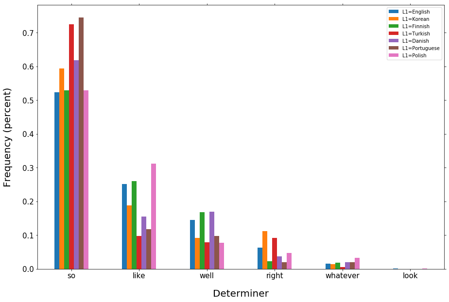

Katherine Kairis, kak275@pitt.edu, 12/15/2017
# Comparing Native and Non-native English
## Table of Contents
* [Introduction](#introduction)
	* [Motivation](#motivation)
	* [Overview of the Data](#overview-of-the-data)
* [Data Processing](#data-processing)
	* [VOICE](#voice)
	* [BNC](#bnc)
* [Anaylsis](#analysis)
	* [Hesitations](#hesitations)
	* [Bigrams](#bigrams)
		* [Comparing BNC and VOICE bigrams](#comparing-bnc-and-voice-bigrams)
		* [Use of Contractions](#use-of-contractions)
	* [Comparing Specific L1s](#comparing-specific-l1s)
		* [Trigrams](#trigrams)
		* [Discourse Markers](#discourse-markers)
		* [Determiners](#determiners)
* [Conclusions](#conclusions)
* [Opportunities for Future Analysis](#opportunities-for-future-analysis)
* [References](#references)

## Introduction
### Motivation
Even after year of studying and speaking a foreign language and gaining proficiency in the language, very few people become completely native-like. Accents and pronunciations of words are often the most noticeable difference between native and non-native speakers. However, there are also other, more subtle differences, like the choice of words and phrases and sentence structure. In this project, I explore some of these differences between native and non-native English speakers.
### Overview of the Data
I used two different corpora in this project: The Vienna-Oxford International Corpus of English (VOICE) and the British National Corpus (BNC).  
The Vienna-Oxford International Corpus of English (VOICE) contains 150 conversations between people from different first language backgrounds who use English as a common language. Overall, the corpus contains about 1 million words. Across all of the conversations, there are 1253 participants representing 50 different L1s (including English). VOICE was compiled Vienna, so (naturally) the vast majority of the speakers speak European languages as L1s. The wide variety of languages did provide a lot of opportunities for intriguing analysis, but having a greater number of participants with L1s from different language families could have been particularly interesting.  
The British National Corpus (VOICE) is much larger than the VOICE; it contains over 100 million words. However, around 90% of the corpus consists of written data, while only about 10% consist of spoken data. Since I compared the BNC to the VOICE (a spoken corpus), I could only use a small portion of the BNC.

## Data Processing
Both the VOICE and the BNC are in XML format, and required a fair amount of processing and refining. To process these files, I used BeautifulSoup, which was very useful for getting the text, attributes, and annotations from the data sets. For both corpora, I stored the conversations into two dictionaries each: one contains the tokens of the conversations, and the other contains (word, part of speech tag) tuples.

### [VOICE](VOICE_data.md)
Most of the data refining for the Vienna-Oxford Corpus of International English consisted of removing inappropriate data that could influence the results of my analyses.  
For example, [86 of the participants in the corpus were native English speakers](VOICE_data.md#getting-the-native-speakers). Since the purpose of this project is to compare the speech of native and non-native speakers, and since the VOICE corpus is meant to act as the non-native corpus, I clearly had to remove these participants and their speech from the data. I also [removed participants](VOICE_data.md#helper-function:-valid_utterance) who had [multiple languages listed as their first language](VOICE_data.md#getting-bilingual-participants). In addition to just comparing native and non-native speech, I also planned on comparing the speech of speakers with specific first languages. Including speakers with multiple first languages would have complicated this analysis.  
In addition to considering the language backgrounds of the participants, I also had to consider the conversation data itself, combined with their tags and attributes. For example, some of the lines in the corpus contained non-English speech. This was particularly common with German speakers; since German is by far the most common L1 in the VOICE, most (if not all) of the conversations included at least one German speaker, so it was relatively common for German speech to appear in the transcripts.  
Finally, I excluded utterances that included the "unclear" tag (for unclear speech), and tags indicating that the speakers was reading out loud.  
The VOICE contains multiple versions of the same conversation: one version contains the untagged utterances (VOICE2.0XML), and the second version contains the conversations with part of speech tags for each word. While this configuration made the files more reasonable, I code for processing the VOICE has to read through two large files for a single conversation, which was not very efficient.  

### [BNC](BNC_data.md)
Most of the processing for the BNC involved extracting only the spoken data from the corpus, which was not as simple as it first seems. It seemed that the data was organized according to topic or context, and there was not any clear distinction between the spoken and the written text. Though, a file was designated as spoken data with the "stext" tag, so finding the spoken data required iterating through all of the files in the BNC and checking for that tag.  
Like the VOICE, the BNC consists of XML files, but the files for the two corpora were structured slightly different. Unlike the VOICE, the BNC only had one file for each conversation. Each word in the BNC is tagged with its lemma and part of speech, which made processing the data and saving the tokens and (word, tag) tuple somewhat easier.  

## Analysis
When I first started this project, I didn't have very specific goals in terms of what aspects of native and non-native speech I wanted to explore, so I first did a preliminary analysis on word tokens, bigrams, stop words. I didn't notice any major differences in the stop word use between native and non-native English speakers. Word token frequencies also seemed similar between the two groups, but there was one interesting point: the word 'er' was very common for both native and non-native speakers, and it was actually the second most frequent token among non-native speakers. At first glance, bigram frequencies did not seem to reveal any major differences, either, but after looking more closely at the most common bigrams, I noticed that a lot of the most common bigrams for non-native speakers were repeated words, like ('the', 'the'). This pattern did not exist among native speakers. Considering the results of my initial analysis, I decided to look into bigrams and hesitations, since they seemed like the most promising area.

### [Hesitations](analysis-hesitiations.md)
To compare hesitations, I started by creating bigrams for both the BNC and the VOICE. Then, for each list of bigrams, I created an additional list of bigrams whose first element and second element matched, which indicated word repetition. Then, I used the length of the repeated words list and the length of the bigrams list to determine the frequency of repeated words. [Non-native speakers in the VOICE repeated words much more frequently than the native speakers in the BNC](analysis-hesitations.md#proportion-of-bigrams-that-contain-repeated-words); about 3% of all bigrams for non-native speakers were repeated words, while this was the case for only about 1% of native bigrams:
  
I also make lists of tokens to compare the frequencies of hesitations words, like "er" and "erm," for native and non-native speech, and [the difference was large](analysis-hesitations.md#proportion-of-hesitation-words-(er, erm, etc.)): about 4.3% of non-native tokens were "hesitation" words, and 2.4% of native speakers' tokens were hesitation words.

### [Bigrams](analysis-bigrams.md)
In my analysis of bigrams, [I created three new groups from the Vienna-Oxford corpus](analysis-bigrams.md#creating-sub-corpora-for-different-language-families): the first group consisted of participants with Germanic L1s, the second consisted of participants with Romance L1s, and the third consisted of participants with Slavic L1s.  
For each group/corpus (BNC, entire VOICE, and the three new subcorpora), I created a list of the bigrams that made up the top 20% in terms of frequency. 
#### Comparing BNC and VOICE bigrams
For the first part of my analysis of bigrams, I tried to [find similarities between the native bigrams and the non-native bigrams](analysis-bigrams.md#similarities-between-voice-and-bnc). Specifically, for each non-native group, I calculated the percent of their most frequent (top 20%) bigrams that also appeared in the BNC's most frequent (top 20%) bigrams.  
Later in my analysis, I [removed bigrams that contained hesitation words and repeated words](analysis-bigrams.md#modifying-the-bigram-list). These dominated the frequent bigrams for non-natve speakers were valuable for revealing some differences between native and non-native speech, but they don't provide much evidence about other linguistic features. After removing these bigrams, the percentage of common (top 20%) bigrams in non-native speech that also occurred in the BNC's most common bigrams increased greatly. For all non-native groups, [over 70% of the common bigrams were also among the BNC's most common bigrams; in some cases (the entire VOICE corpus and the Germanic group), this percentage approached 80%. Looking into the bigrams that were now common in VOICE but not BNC showed a few patterns: a lot of these bigrams were words that native speakers often replace with contractions, like "we are," "they are," "is not," "we will," "what is," and "i will." Also, several of these bigrams were very formulaic transition phrases, like "for example."
  

PUT DATAFRAME HERE  
  
Then, in order to get a better idea as to the what bigrams caused the discrepencies between native and non-native speech, I generated two lists of bigrams: one contains bigrams that were common in VOICE but not in the BNC, and the other contains bigrams common in the BNC but not in VOICE. The bigrams that were common in VOICE but not in the BNC mirrored the results of my hesitation analysis: many of those bigrams either contained repeated words or hesitation words like "er" and "erm." Investigating the bigrams common in BNC but not in VOICE revealed an interesting trend: around 15% of these bigrams were contractions.

#### [Use of Contractions](analysis-l1s.md#comparing-contraction-use)
The realization that contractions occurred more frequently in native speech prompted me further explore contraction use. First, I calculated the percentage of contractions that occurred in the BNC and each L1 group from voice. Contractions comprised about 5.3% of native speech in the BNC, but only around 3% for the non-native groups:  
  
Looking into the specific bigrams that the participant groups used revealed even more interesting patterns. I used NLTK's frequency dictionary to determine the [15 most common contractions in the BNC, and compared their frequencies across the 4 L1 groups](analysis-bigrams.md#comparing-use-of-specific-contractions-in-each-L1-group) (English/BNC, Germanic, Romance, and Slavic). The four most common contractions for native speakers were it's, that's, don't, and i'm. These were also common among the non-native groups; in fact, the proportions of these four contractions were higher among the three non-native groups then they were among the native speakers. Between the fifth and fifteenth most common bigrams, the frequencies gradually decreased and leveled off for native speakers in the BNC, while the proportions of these contractions dramatically dropped off for the non-native speakers:
  

### [Comparing Specific L1s](analysis-L1s.md)
For bigrams, I compared 3 different language families. Here, I compare 7 different first languages (Korean, Finnish, Turkish, Danish, Portuguese, and Polish) to English. Also, unlike my previous analyses, I used the English speakers from the VOICE instead of the BNC, since the number of English speakers in VOICE is comparable to the number of speakers of other L1s that I'm exploring here. Also, since I am using data from the same corpus this time, I decided to use the part of speech tags since they are consistent here.
#### [Trigrams](analysis-L1s.md#trigrams)
I first compared part of speech trigrams across the 7 different L1 groups. The most common trigram for 6 of the 7 language groups was (INfIN, DTfDT, NNfNN), which corresponds to (infinitive, determiner, noun). The only exception was Korean, whose most common trigram was (REfRE, REfRE, REfRE) which corresponds to three consecutive response particles. For all languages, the same trigrams tended to appear among the top 5 most common, like (DTfDT, JJfJJ, NNfNN) -- (determiner, adjective, noun) and (NNfNN, INfIN, DTfDT) -- (noun, infinitive, determiner), in addition to the two trigrams mentioned above. After this point, the trigrams and their rankings in each language become less consistent.
#### [Discourse Markers](analysis-L1s.md#comparing-discourse-markers)
When comparing the use of discourse markers, like "look," "right," "so," "like", I first compared the frequency of discourse markers among each L1. With the exception of Portuguese, the proportion of discourse among the different L1 groups was relatively consistent, and fell between 1.2-1.5%. Portuguese speakers used discourse markers about 0.8% of the time.  
The frequencies of discourse markers across the L1s were somewhat consistent, but difference emerge when the specific discourse makers are explored. All L1 groups, particularly Portuguese and Turkish, use "so" very frequently; for most L1 groups, "so" comprises about 50% of the discourse markers used, while this percentage rises to 61% for Danish speakers, 72% of Turkish speakers, and 75% of Portuguese speakers. Another interesting observation is the use of "right." This word accounts for about 11% of the Korean speakers' determiner use, while making up much smaller percentages for the other L1 groups.
  
#### [Determiners](analysis-L1s.md#comparing-article/determiner-use)
Like discourse marker use, the use of determiners was relatively consistent across the L1 groups. The use of specific determiners used across the 7 language groups becomes more variable, though.

## Conclusions
A lot of the differences between native and non-native speakers can likely be attributed to non-native speakers' lack of comfort using English. A lot of the non-native speakers' bigrams consist of stuttering/repeated words, and hestitation words like "er" and "erm." When such bigrams are removed from consideration, the non-native speakers' bigram lists become significantly more similar to the native speakers' bigram list.  
However, even if these bigrams are removed, there are stil some major differences between the two groups. The native speakers seem to rely on and overuse common English structures, like the four most common contractions. At the same time, they seem to struggle applying these contraction rules to other context where the use of these constructions would be appropriate. This is particularly noticeable for contractions invloving the word "have."  
Despite the difference in bigrams, there are a few aspects of speech that non-native speakers seem to adopt more easily. For example, the percentage of discourse markers for non-native speakers did not differ to greatly from native speakers, possibly indicating that these elements translate easily from one language to another. However, the use of specific discourse markers does show some greater differences. In this case, the specific L1 likely plays an important role, but, since I am unfamiliar with the 6 L1s that I compared to English, I am not able to make any strong conclusion about the effect of the L1s on these aspects of language.
## Opportunities for Future Analysis
I was planning on trying some machine learning algorithms to see if they could predict whether a speaker is a native or non-native English speaker, but I ran out of time. With the exception of hesitation words, I didn't spend a lot of time exploring word tokens. Using a "bag of words" classifier could be interesting and possible reveal any differences in word uses between native English speakers and non-native English speakers. Also, using an algorithm that allows selecting features could be interesting. If I were to do this, I would try using proportion of repeated words and proportions of contractions as starting points.  
Another possible option is using the VOICE corpus to see if the number of native English speakers in a conversation affects the speech of non-native speakers. For example, does their speech become more native-like when when they converse with native speakers?
## References
BNC website: http://www.natcorp.ox.ac.uk  
VOICE website: https://www.univie.ac.at/voice/