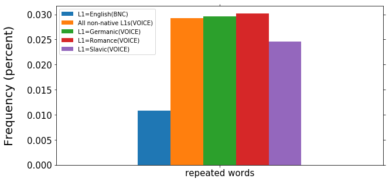
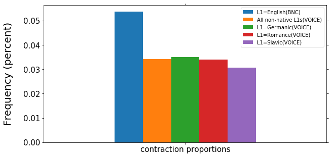
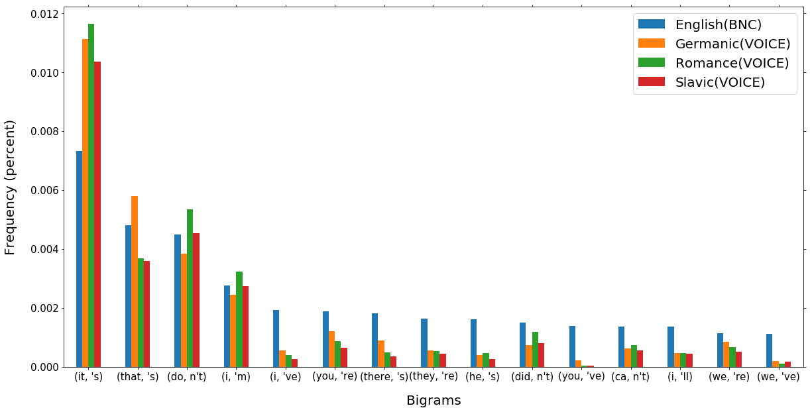

# Comparing Native and Non-native English
## Table of Contents
* [Introduction](#introduction)
	* [Motivation](#motivation)
	* [Overview of the Data](#overview-of-the-data)
* [Data Processing](#data-processing)
	* [VOICE](#voice)
	* [BNC](#bnc)
* [Anaylsis](#analysis)
	* [Hesitations](#hesitations)
	* [Bigrams](#bigrams)
		*[Use of Contractions](#use-of-contractions)
	* [Comparing Specific L1s](#comparing-specific-l1s)

## Introduction
### Motivation
Even after year of studying and speaking a foreign language and gaining proficiency in the language, very few people become completely native-like. Accents and pronunciations of words are often the most noticeable difference between native and non-native speakers. However, there are also other, more subtle differences, like the choice of words and phrases and sentence structure. In this project, I explore some of these differences between native and non-native English speakers.
### Overview of the Data
I used two different corpora in this project: The Vienna-Oxford International Corpus of English (VOICE) and the British National Corpus (BNC).  
The Vienna-Oxford International Corpus of English (VOICE) contains 150 conversations between people from different first language backgrounds who use English as a common language. Overall, the corpus contains about 1 million words. Across all of the conversations, there are 1253 participants representing 50 different L1s (including English). VOICE was compiled Vienna, so (naturally) the vast majority of the speakers speak European languages as L1s. The wide variety of languages did provide a lot of opportunities for intriguing analysis, but having a greater number of participants with L1s from different language families could have been particularly interesting.  
The British National Corpus (VOICE) is much larger than the VOICE; it contains over 100 million words. However, around 90% of the corpus consists of written data, while only about 10% consist of spoken data. Since I compared the BNC to the VOICE (a spoken corpus), I could only use a small portion of the BNC.

## Data Processing
Both the VOICE and the BNC are in XML format, and required a fair amount of processing and refining. To process these files, I used BeautifulSoup, which was very useful for getting the text, attributes, and annotations from the data sets. For both corpora, I stored the conversations into two dictionaries each: one contains the tokens of the conversations, and the other contains (word, part of speech tag) tuples.

### VOICE
The code for processing the Vienna-Oxford International Corpus of English can be found here: https://github.com/Data-Science-for-Linguists/Native_and_Non-native_English/blob/master/VOICE_data.ipynb  
Most of the data refining for the Vienna-Oxford Corpus of International English consisted of removing inappropriate data that could influence the results of my analyses.  
For example, 86 of the participants in the corpus were native English speakers. Since the purpose of this project is to compare the speech of native and non-native speakers, and since the VOICE corpus is meant to act as the non-native corpus, I clearly had to remove these participants and their speech from the data. I also removed participants who had multiple languages listed as their first language. In addition to just comparing native and non-native speech, I also planned on comparing the speech of speakers with specific first languages. Including speakers with multiple first languages would have complicated this analysis.  
In addition to considering the language backgrounds of the participants, I also had to consider the conversation data itself, combined with their tags and attributes. For example, some of the lines in the corpus contained non-English speech. This was particularly common with German speakers; since German is by far the most common L1 in the VOICE, most (if not all) of the conversations included at least one German speaker, so it was relatively common for German speech to appear in the transcripts.  
Finally, I excluded utterances that included the "unclear" tag (for unclear speech), and tags indicating that the speakers was reading out loud.  
The VOICE contains multiple versions of the same conversation: one version contains the untagged utterances (VOICE2.0XML), and the second version contains the conversations with part of speech tags for each word. While this configuration made the files more reasonable, I code for processing the VOICE has to read through two large files for a single conversation, which was not very efficient.  

### BNC
The code for processing the Vienna-Oxford International Corpus of English can be found here: https://github.com/Data-Science-for-Linguists/Native_and_Non-native_English/blob/master/BNC_data.ipynb  
Most of the processing for the BNC involved extracting only the spoken data from the corpus, which was not as simple as it first seems. It seemed that the data was organized according to topic or context, and there was not any clear distinction between the spoken and the written text. Though, a file was designated as spoken data with the "stext" tag, so finding the spoken data required iterating through all of the files in the BNC and checking for that tag.  
Like the VOICE, the BNC consists of XML files, but the files for the two corpora were structured slightly different. Unlike the VOICE, the BNC only had one file for each conversation. Each word in the BNC is tagged with its lemma and part of speech, which made processing the data and saving the tokens and (word, tag) tuple somewhat easier.  

## Analysis
When I first started this project, I didn't have very specific goals in terms of what aspects of native and non-native speech I wanted to explore, so I first did a preliminary analysis on word tokens, bigrams, stop words. I didn't notice any major differences in the stop word use between native and non-native English speakers. Word token frequencies also seemed similar between the two groups, but there was one interesting point: the word 'er' was very common for both native and non-native speakers, and it was actually the second most frequent token among non-native speakers. At first glance, bigram frequencies did not seem to reveal any major differences, either, but after looking more closely at the most common bigrams, I noticed that a lot of the most common bigrams for non-native speakers were repeated words, like ('the', 'the'). This pattern did not exist among native speakers. Considering the results of my initial analysis, I decided to look into bigrams and hesitations, since they seemed like the most promising area.
### Hesitations
To compare hesitations, I started by creating bigrams for both the BNC and the VOICE. Then, for each list of bigrams, I created an additional list of bigrams whose first element and second element matched, which indicated word repetition. Then, I used the length of the repeated words list and the length of the bigrams list to determine the frequency of repeated words. Non-native speakers in the VOICE repeated words much more frequently than the native speakers in the BNC; about 3% of all bigrams for non-native speakers were repeated words, while this was the case for only about 1% of native bigrams:

I also make lists of tokens to compare the frequencies of hesitations words, like "er" and "erm," for native and non-native speech, and the difference was large: about 4.3% of non-native tokens were "hesitation" words, and 2.4% of native speakers' tokens were hesitation words.
### Bigrams
#### Use of Contractions

### Comparing Specific L1s
